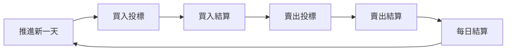
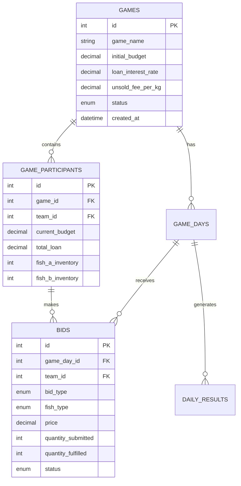

# 🐟 魚市場遊戲 Fish Market Trading Game

[](https://github.com/your-repo/fish-market-game)
[](LICENSE)
[](https://nodejs.org/)

一個模擬魚貨批發市場的經濟策略遊戲，適用於商業決策、供應鏈管理和經濟學教學。

## 📋 目錄

- [遊戲概述](#-遊戲概述)
- [遊戲規則](#-遊戲規則)
- [策略指南](#-策略指南)
- [計算邏輯](#-計算邏輯)
- [實戰範例](#-實戰範例)
- [安裝指南](#-安裝指南)
- [技術架構](#-技術架構)

## 🎯 遊戲概述

### 遊戲目標
在魚市場遊戲中，您扮演魚貨批發商，需要從總代理手中進貨，再轉售給餐廳。您的目標是通過精明的買賣策略，在有限的資金下創造最高的**投資報酬率（ROI）**。

### 🏪 市場結構

| 角色 | 功能 | 特點 |
|------|------|------|
| 🎣 **總代理（供應端）** | 提供魚貨 | • 每日提供A級魚、B級魚<br>• 供應量有限，價高者得<br>• 設有底價保護 |
| 🏢 **餐廳（需求端）** | 採購魚貨 | • 每日固定預算採購<br>• 價低者優先成交<br>• 預算用完即停止 |
| 💼 **您（批發商）** | 中間商 | • 向總代理買魚、賣給餐廳<br>• 管理資金與庫存<br>• 承擔滯銷風險 |

### ⏰ 遊戲流程



1. **推進新一天** - 管理員設定市場參數
2. **買入投標** - 向總代理出價收購魚貨（7分鐘）
3. **買入結算** - 系統分配魚貨給得標者
4. **賣出投標** - 向餐廳出價銷售魚貨（4分鐘）
5. **賣出結算** - 系統處理餐廳採購
6. **每日結算** - 計算損益、利息、ROI

### 🏆 獲勝條件

**投資報酬率（ROI）最高的團隊獲勝**

```
ROI = (累積利潤 / 總投資金額) × 100%
總投資金額 = 初始資金 + 總借貸金額
```

## 📖 遊戲規則

### 💰 資金管理規則

#### 初始資金
- 每個團隊獲得相同的初始預算（通常 $1,000,000）
- 資金可用於購買魚貨

#### 自動借貸機制
- **觸發條件**：購買金額超過現有資金時自動提供貸款
- **借貸額度**：初始預算的 50%
- **利率計算**：每日按複利計算（通常 3%/日）
- **利息扣除**：自動從現金中扣除

### 🐟 魚貨交易規則

#### 魚種分類
- **A級魚**：高價值魚種，供應量較少，目標價格較高
- **B級魚**：一般魚種，供應量較多，目標價格較低

#### 投標限制
- ✅ 每種魚最多可出 **2個不同價格** 的標單
- ✅ 買入時：總出價不得超過 `現金 + 剩餘借貸額度`
- ✅ 賣出時：出售數量不得超過庫存

#### 成交規則
- **買入**：價格由高到低分配，直到供應量用完
- **賣出**：價格由低到高成交，直到餐廳預算用完
- **固定滯銷**：最高價標單的 **2.5%** 直接判定滯銷

### 📦 庫存管理規則

> ⚠️ **重要**：每日結束後，所有庫存自動清零（模擬魚貨保鮮期限）

- ❌ 魚貨無法跨日保存，每日必須清倉
- 💸 未售出的魚貨收取滞銷費（$10/kg）
- 📉 滯銷費直接從現金中扣除

### 🎮 操作規則

| 階段 | 時間限制 | 說明 |
|------|----------|------|
| 買入投標 | 7分鐘 | 向總代理出價購買 |
| 賣出投標 | 4分鐘 | 向餐廳出價銷售 |

- 🔒 時間到後系統自動結算，無法再修改標單
- 👥 每個團隊只能有一個人同時操作
- 🤝 建議團隊內部先討論策略再投標

## 💡 策略指南

### 🎯 買入策略

#### 價格定位策略
| 策略 | 特點 | 適用場景 |
|------|------|----------|
| **保守派** | 出價接近底價 | 確保低成本，但得標量可能較少 |
| **積極派** | 出價較高 | 確保得標，但壓縮利潤空間 |
| **混合派** | 兩個標單設不同價格 | 分散風險，兼顧成本與數量 |

#### 💰 資金管理策略
- ✅ 善用借貸額度，但控制利息成本
- ✅ 預留資金因應後續幾天的機會  
- ✅ 計算每日可承受的最大利息支出
- ✅ 避免過度借貸，影響最終ROI

#### 📊 數量分配策略
- 🎣 A級魚：利潤高但風險大
- 🐟 B級魚：利潤較低但較穩定
- 📈 根據歷史銷售情況調整採購比例
- 💼 考慮餐廳預算限制，避免過度採購

### 🎯 賣出策略

#### ⚠️ 滯銷風險控制

> 💡 **關鍵策略**：避免最高價滯銷陷阱

- ❌ **不要盲目出最高價** - 有2.5%會直接滯銷
- 🎚️ **價格梯度設計** - 用兩個價格測試市場接受度  
- 👁️ **競爭對手分析** - 觀察其他團隊的定價傾向

#### 💸 定價策略
1. **成本加成法**：`買價 + 目標利潤 + 風險緩衝`
2. **市場導向法**：參考目標價格設定合理區間
3. **競爭導向法**：略低於預期的競爭對手價格

#### 📈 建議價格設定
- **第一標**：積極價格，確保部分成交
- **第二標**：保守價格，清倉止損
- **成本考量**：務必計入滯銷費成本（$10/kg）

### ⚖️ 風險管理

| 風險類型 | 影響因素 | 控制方法 |
|----------|----------|----------|
| 💸 **滯銷風險** | • 每公斤$10處理費<br>• 最高價2.5%固定滯銷<br>• 餐廳預算不足 | • 合理定價<br>• 避免最高價<br>• 控制庫存量 |
| 📈 **利息風險** | • 每日3%複利累積<br>• 長期借貸成本驚人 | • 控制借貸規模<br>• 盡早回收資金<br>• 計算利息成本 |
| 🎲 **市場風險** | • 供需量每日變化<br>• 競爭對手策略 | • 分散投資<br>• 靈活調整策略<br>• 觀察市場趨勢 |

## 🔢 計算邏輯

### 買入階段計算

#### 資金檢查邏輯
```javascript
總出價 = Σ(價格 × 數量)
可用資金 = 現金 + 剩餘借貸額度
if (總出價 > 可用資金) { 
    拒絕投標 
}
```

#### 成交分配邏輯
```javascript
1. 所有投標按價格降序排列
2. 從最高價開始，逐一分配供應量
3. 成交量 = min(投標量, 剩餘供應量)
4. 更新團隊庫存和現金/借貸
```

#### 借貸計算邏輯
```javascript
if (成交金額 > 現金) {
    新借貸 = 成交金額 - 現金
    總借貸 += 新借貸
    現金 = 0
} else {
    現金 -= 成交金額
}
```

### 賣出階段計算

#### 固定滯銷計算
```javascript
最高價投標 = 找出價格最高的所有投標
滯銷數量 = ceil(最高價投標總量 × 2.5%)
// 晚出價者優先滯銷
```

#### 正常成交計算
```javascript
1. 扣除固定滯銷後，剩餘投標按價格升序排列
2. 從最低價開始，逐一購買
3. 成交條件：餐廳預算 ≥ 價格 × 數量
4. 預算不足時：部分成交 = floor(預算 ÷ 價格)
```

#### 滯銷費計算
```javascript
總滯銷量 = 庫存 - 售出量
滯銷費 = 總滯銷量 × $10
現金 -= 滯銷費
```

### 每日結算計算

#### 利息計算（複利）
```javascript
每日利息 = 總借貸 × 日利率(3%)
新總借貸 = 總借貸 + 每日利息
現金 -= 每日利息

if (現金 < 0) {
    追加借貸 = |現金|
    總借貸 += 追加借貸
    現金 = 0
}
```

#### 每日損益計算
```javascript
每日收益 = 銷售收入 - 採購成本 - 滯銷費 - 利息
累積收益 += 每日收益
```

#### ROI 更新計算
```javascript
總投資 = 初始預算 + 總借貸本金
ROI = (累積收益 ÷ 總投資) × 100%
```

## 📊 實戰範例

### 範例1：買入投標與成交

**市場狀況**：A級魚供應量 1,200kg，底價 $120/kg

**投標情況**：
- 團隊甲：$200/kg × 500kg = $100,000
- 團隊乙：$180/kg × 600kg = $108,000  
- 團隊丙：$160/kg × 400kg = $64,000

**成交結果**：
1. 團隊甲：$200/kg × 500kg → ✅ 成交 500kg
2. 團隊乙：$180/kg × 600kg → ✅ 成交 600kg  
3. 團隊丙：$160/kg × 400kg → ⚠️ 成交 100kg（剩餘供應量）

### 範例2：賣出投標與滯銷

**市場狀況**：A級魚餐廳預算 $300,000

**投標情況**：
- 團隊甲：$250/kg × 400kg（最高價）
- 團隊乙：$220/kg × 300kg
- 團隊丙：$200/kg × 500kg

**固定滯銷**：
```
最高價滯銷量 = ceil(400 × 2.5%) = 10kg
```

**正常成交（按價格升序）**：
1. 團隊丙：$200/kg × 500kg → ✅ 成交 500kg（花費 $100,000）
2. 團隊乙：$220/kg × 300kg → ✅ 成交 300kg（花費 $66,000）  
3. 團隊甲：$250/kg × 390kg → ⚠️ 部分成交（花費 $97,500）

**最終結果**：
- 團隊甲：390kg成交 + 10kg滯銷 = 滯銷費 $100
- 餐廳剩餘預算：$36,500

### 範例3：每日結算計算

**團隊狀況**：
- 初始現金：$500,000
- 總借貸：$200,000
- 當日收益：$50,000
- 當日成本：$180,000
- 滯銷費：$500

**計算過程**：
```javascript
// 1. 計算利息
每日利息 = $200,000 × 3% = $6,000
新總借貸 = $200,000 + $6,000 = $206,000

// 2. 計算當日淨損益
當日淨收益 = $50,000 - $180,000 - $500 - $6,000 = -$136,500

// 3. 更新現金狀況
新現金 = $500,000 - $136,500 = $363,500

// 4. 計算ROI
總投資 = $1,000,000 + $206,000 = $1,206,000
累積收益 = 之前累積 + (-$136,500)
當前ROI = (累積收益 ÷ $1,206,000) × 100%
```

## 🚀 安裝指南

### 系統需求
- Node.js 18.0+
- MySQL 8.0+
- 4GB+ RAM
- 10GB+ 硬碟空間

### 快速開始

1. **克隆專案**
```bash
git clone https://github.com/your-repo/fish-market-game.git
cd fish-market-game
```

2. **安裝依賴**
```bash
npm install
```

3. **資料庫設置**
```bash
# 匯入資料庫結構
mysql -u root -p < SQL/fishmarket_game_latest.sql
```

4. **環境配置**
```bash
# 複製環境變數檔案
cp .env.example .env

# 編輯資料庫連線資訊
nano .env
```

5. **啟動服務**
```bash
npm start
```

6. **訪問遊戲**
- 管理員界面：`http://localhost:3000/admin.html`
- 學生界面：`http://localhost:3000/simple-team.html`

### Docker 部署

```bash
# 使用 Docker Compose 快速部署
docker-compose up -d
```

## 🛠️ 技術架構

### 後端技術
- **Node.js + Express** - 後端服務框架
- **MySQL** - 資料庫存儲
- **Socket.io** - 即時通訊
- **JWT** - 使用者認證
- **Decimal.js** - 精確數學運算

### 前端技術
- **原生 JavaScript** - 客戶端邏輯
- **HTML5 + CSS3** - 使用者介面
- **WebSocket** - 即時更新
- **Chart.js** - 資料視覺化

### 系統特色
- 🔄 **即時更新** - WebSocket 推送遊戲狀態
- 🔒 **安全認證** - JWT Token 驗證
- 💾 **資料完整性** - 事務處理保證
- 📱 **響應式設計** - 支援各種設備
- 📊 **數據分析** - 完整的遊戲統計

### 資料庫設計



## 📈 教學應用

### 適用課程
- 📚 **經濟學原理** - 供需機制、市場均衡
- 💼 **企業管理** - 決策分析、風險管理
- 📊 **財務管理** - 資金運用、ROI分析
- 🔗 **供應鏈管理** - 庫存控制、成本管理

### 學習目標
- 理解市場機制運作
- 培養商業決策能力
- 學習風險控制技巧
- 體驗競爭與合作

### 評估指標
- ROI 表現
- 決策過程分析
- 風險管理能力
- 團隊協作效果

## 🤝 貢獻指南

歡迎貢獻代碼、回報問題或提出建議！

### 開發環境設置
```bash
# Fork 專案後克隆
git clone https://github.com/your-username/fish-market-game.git

# 創建功能分支
git checkout -b feature/your-feature-name

# 提交更改
git commit -m "Add: your feature description"

# 推送分支
git push origin feature/your-feature-name
```

### 問題回報
請使用 [GitHub Issues](https://github.com/your-repo/fish-market-game/issues) 回報問題。

## 📄 授權條款

本專案採用 [MIT License](LICENSE) 授權。

## 📞 聯絡資訊

- **專案維護者**：[Your Name](mailto:your.email@example.com)
- **專案網站**：[https://your-website.com](https://your-website.com)
- **問題回報**：[GitHub Issues](https://github.com/your-repo/fish-market-game/issues)

---

⭐ 如果這個專案對您有幫助，歡迎給個星星支持！

🎮 **開始您的魚市場交易之旅吧！**