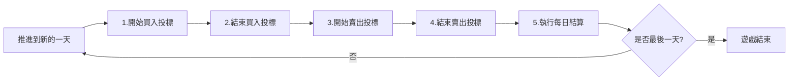

# 🐟 魚市場遊戲 - 完整遊戲說明書

## 📚 目錄
1. [遊戲概述](#遊戲概述)
2. [遊戲參數設定](#遊戲參數設定)
3. [遊戲流程](#遊戲流程)
4. [計算邏輯](#計算邏輯)
5. [策略要點](#策略要點)

---

## 🎯 遊戲概述

### 遊戲目標
魚市場遊戲是一個經濟策略模擬遊戲，玩家扮演魚貨中盤商，在有限的資金下進行魚貨買賣，目標是在遊戲結束時達到最高的投資報酬率（ROI）。

### 核心機制
- **雙邊市場**：向總代理買魚，再賣給餐廳
- **價格競爭**：透過投標機制決定成交
- **資金管理**：合理運用現金與借貸
- **風險控制**：避免滯銷損失

### 參與角色
- **管理員/教師**：創建遊戲、控制流程、查看結果
- **團隊/學生**：1-12組，每組獨立決策參與競標

---

## ⚙️ 遊戲參數設定

### 基本參數
| 參數名稱 | 預設值 | 說明 | 影響 |
|---------|--------|------|------|
| **遊戲名稱** | - | 自定義遊戲識別名稱 | 用於區分不同場次 |
| **遊戲天數** | 7天 | 遊戲進行的總天數 | 決定遊戲長度 |
| **參與組數** | 12組 | 實際參與的團隊數量 | 影響供需計算基準 |

### 財務參數
| 參數名稱 | 預設值 | 說明 | 策略影響 |
|---------|--------|------|----------|
| **初始資金** | $1,000,000 | 每組開始時的現金 | 決定初期購買力 |
| **每日借貸利率** | 3% | 借款的每日利息 | 影響借貸成本 |
| **滯銷處理費** | $10/kg | 未售出魚貨的處理成本 | 增加庫存風險 |
| **固定滯銷比例** | 2.5% | 最高價的此比例直接滯銷 | 避免盲目高價 |

### 市場參數
| 參數名稱 | 預設值 | 說明 | 市場意義 |
|---------|--------|------|----------|
| **A級魚底價** | $100 | 中盤商對漁民的最低收購價 | 保護漁民利益 |
| **B級魚底價** | $100 | 中盤商對漁民的最低收購價 | 保護漁民利益 |
| **A級魚預期售價** | $500 | 餐廳願意支付的參考價格 | 影響餐廳預算 |
| **B級魚預期售價** | $300 | 餐廳願意支付的參考價格 | 影響餐廳預算 |

### 每日市場參數（系統自動生成）
| 參數 | 計算方式 | 變動範圍 | 說明 |
|------|---------|----------|------|
| **A級魚供給量** | 組數 × 150kg × 隨機係數 | ±20% | 每日漁獲量 |
| **B級魚供給量** | 組數 × 300kg × 隨機係數 | ±20% | 每日漁獲量 |
| **A級魚餐廳預算** | 供給量 × 預期售價 × 隨機係數 | ±20% | 餐廳購買力 |
| **B級魚餐廳預算** | 供給量 × 預期售價 × 隨機係數 | ±20% | 餐廳購買力 |

---

## 🔄 遊戲流程

### 一、遊戲準備階段

#### 1.1 管理員創建遊戲
```
管理員登入 → 創建新遊戲 → 設定所有參數 → 遊戲創建成功
```

#### 1.2 團隊加入遊戲
```
團隊登入(01-12) → 一鍵加入遊戲 → 設定團隊名稱 → 等待開始
```

### 二、每日遊戲流程（六步驟）

#### 📅 每天的完整流程：



#### 步驟詳解：

### 🔹 步驟0：推進到下一天
- **管理員操作**：點擊「推進到下一天」
- **系統動作**：
  - 生成新一天的市場參數（供給量、餐廳預算）
  - 重置所有團隊的投標狀態
  - 可手動設定參數或使用系統自動生成

### 🔹 步驟1：開始買入投標
- **管理員操作**：設定時間（預設7分鐘）→ 點擊開始
- **團隊操作**：提交買入標單
  - 每種魚最多出2個不同價格（price_index: 1或2）
  - 最多4張標單（A級魚2張 + B級魚2張）
  - 系統檢查：總出價 ≤ 現金  否則要貸款   累積貸款總額不能超過初始預算*50%
- **投標策略**：
  - 價格越高，得標機率越大
  - 但需考慮資金限制和轉售利潤

### 🔹 步驟2：結束買入投標
- **管理員操作**：點擊結束（或等待倒數結束）
- **系統計算**：
  1. 按價格由高到低排序
  2. 依序分配魚貨直到供給量用完
  3. 記錄成交結果到 transactions 表
  4. 更新團隊庫存和現金
  5. 超過現金部分自動借貸

### 🔹 步驟3：開始賣出投標
- **管理員操作**：設定時間（預設4分鐘）→ 點擊開始
- **團隊操作**：提交賣出標單
  - 每種魚最多出2個不同價格
  - 數量不得超過庫存
- **投標策略**：
  - 價格越低，成交機率越大
  - 但需確保獲利

### 🔹 步驟4：結束賣出投標
- **管理員操作**：點擊結束（或等待倒數結束）
- **系統計算**：
  1. **固定滯銷處理**：最高價的2.5%直接判定滯銷
  2. **價格排序**：剩餘標單按價格由低到高排序
  3. **預算分配**：依序購買直到餐廳預算用完
  4. **滯銷處理**：未售出的魚貨收取處理費
  5. 更新團隊現金和庫存   當日不論有沒有賣出 庫存都歸0

### 🔹 步驟5：執行每日結算
- **管理員操作**：點擊「執行每日結算」
- **系統計算**：
  1. 計算當日借貸利息
  2. 更新累積收益
  3. 計算ROI排名
  4. 記錄到 daily_summaries 表
  5. 生成當日報表

---

## 🧮 計算邏輯

### 1. 買入階段計算

#### 1.1 資金檢查
```javascript
總出價 = Σ(價格 × 數量)  // 所有標單加總
最大允許 = 現金 + 剩餘允許貸款總額
if (總出價 > 最大允許) {
    拒絕投標
}
```

#### 1.2 借貸計算
```javascript
借貸金額 = max(0, 總出價 - 現金)
借貸總額 = 原借貸 + 借貸金額
```

#### 1.3 成交分配（價高者得）
```javascript
// 按價格降序排列
投標排序 = 按價格由高到低
剩餘供給 = 總供給量

for (每個投標) {
    if (剩餘供給 > 0) {
        成交量 = min(投標量, 剩餘供給)
        剩餘供給 -= 成交量
        記錄交易(成交量, 價格)
    }
}
```

### 2. 賣出階段計算

#### 2.1 固定滯銷計算
```javascript
所有投標 = 獲取所有賣出投標
最高價投標 = 篩選最高價格的投標
滯銷數量 = 最高價投標總量 × 固定滯銷比例(2.5%)
滯銷數量 = Math.ceil(滯銷數量)  // 無條件進位

// 同價位時，晚出價者優先滯銷
最高價投標.按時間降序排列()
分配滯銷(滯銷數量)
```

#### 2.2 正常成交計算（價低者得）
```javascript
剩餘投標 = 排除滯銷後的投標
投標排序 = 按價格由低到高
剩餘預算 = 餐廳預算

for (每個投標) {
    需要金額 = 價格 × 數量
    if (剩餘預算 >= 需要金額) {
        剩餘預算 -= 需要金額
        記錄成交(數量, 價格)
    } else {
        部分成交 = floor(剩餘預算 / 價格)
        if (部分成交 > 0) {
            記錄成交(部分成交, 價格)
        }
        break
    }
}
```

#### 2.3 滯銷費用計算
```javascript
滯銷數量 = 庫存 - 售出數量
滯銷費用 = 滯銷數量 × 滯銷處理費(10元/kg)
現金 -= 滯銷費用
```

### 3. 每日結算計算

#### 3.1 利息計算
```javascript
當日利息 = 總借貸 × 每日利率(3%)
總借貸 += 當日利息
現金 -= 當日利息
```

#### 3.2 收益計算
```javascript
當日收益 = 賣出收入 - 買入成本 - 滯銷費用 - 利息
累積收益 += 當日收益
```

#### 3.3 ROI計算
```javascript
ROI = (累積收益 / (初始資金 + 總借貸)) × 100%
```

---

## 💡 策略要點

### 買入策略
1. **價格定位**：平衡得標機率與成本
2. **數量控制**：考慮資金限制和市場需求
3. **多價格策略**：利用2個價格增加靈活性
4. **資金管理**：善用貸款（初始預算50%上限）但控制借貸

### 賣出策略
1. **避免滯銷**：不要盲目追求最高價（2.5%會直接滯銷）
2. **價格競爭**：在確保利潤下競爭成交
3. **庫存管理**：平衡持有風險與獲利機會
4. **分散定價**：利用2個價格分散風險

### 財務管理
1. **借貸控制**：3%日息累積快速
2. **現金流**：維持足夠現金避免被動
3. **ROI優化**：收益和借貸的平衡

### 風險控制
1. **滯銷風險**：$10/kg的處理費
2. **價格風險**：買高賣低的損失
3. **競爭風險**：其他團隊的策略影響

---

## 📊 遊戲結束與評分

### 結束條件
- 完成設定的遊戲天數（預設7天）
- 管理員強制結束

### 最終排名
- 依據ROI由高到低排序
- ROI = (累積收益 / (初始資金 + 總借貸)) × 100%

### 數據分析
- 每日買賣記錄
- 損益變化曲線
- 策略效果分析
- 市場供需關係

---

## 🎓 教學價值

1. **經濟學概念**：供需關係、價格機制、市場競爭
2. **財務管理**：資金運用、借貸決策、風險控制
3. **決策分析**：數據分析、策略制定、即時調整
4. **團隊合作**：分工協作、溝通討論、共同決策

---

## 📝 備註

- 所有金額以新台幣計算
- 所有數量以公斤(kg)為單位
- 時間以分鐘為單位
- 系統自動記錄所有交易細節供事後分析